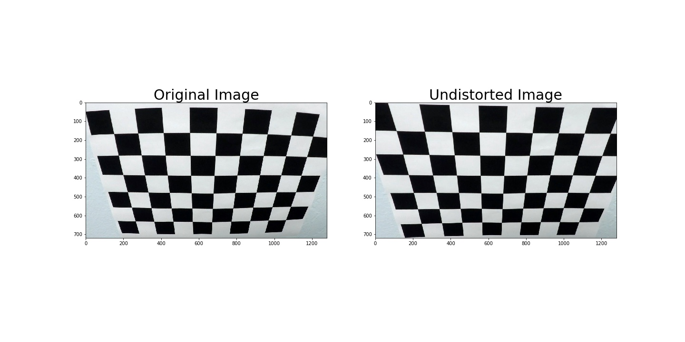
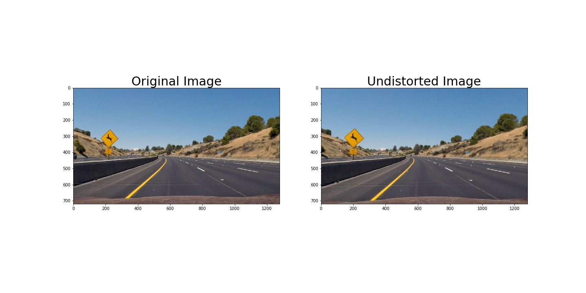
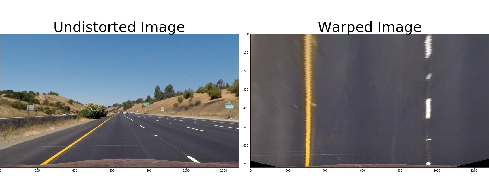
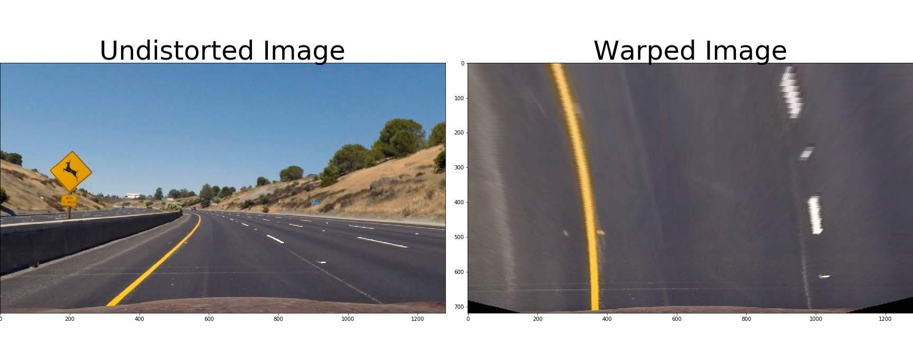
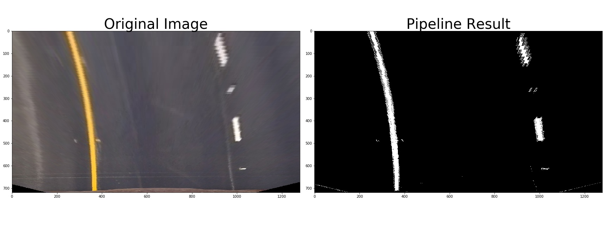
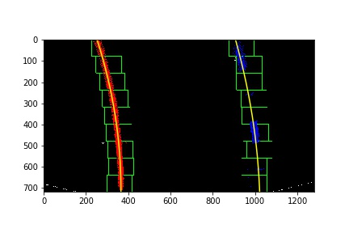
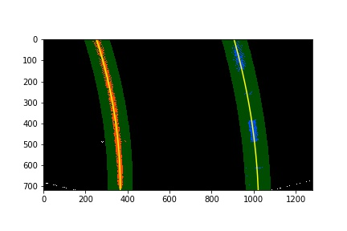
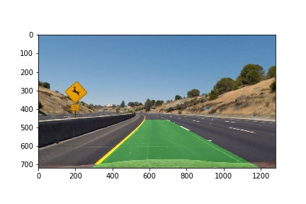
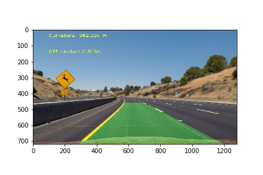

## Advanced Lane Finding

The Project
---

The goals / steps of this project are the following:
* Compute the camera calibration matrix and distortion coefficients given a set
of chessboard images.
* Apply a distortion correction to raw images.
* Use color
transforms, gradients, etc., to create a thresholded binary image.
* Apply a
perspective transform to rectify binary image ("birds-eye view").
* Detect lane
pixels and fit to find the lane boundary.
* Determine the curvature of the lane
and vehicle position with respect to center.
* Warp the detected lane boundaries
back onto the original image.
* Output visual display of the lane boundaries and
numerical estimation of lane curvature and vehicle position.

The images for
camera calibration are stored in the folder called `camera_cal`.  The images in
`test_images` are for testing your pipeline on single frames.  If you want to
extract more test images from the videos, you can simply use an image writing
method like `cv2.imwrite()`, i.e., you can read the video in frame by frame as
usual, and for frames you want to save for later you can write to an image file.
Save examples of the output from each stage of your pipeline in the folder called `output_images`, and include a
description in my README.md for the project of what each image shows.    The
video called `project_video.mp4` is the video your pipeline should work well on.
The `challenge_video.mp4` video is an extra (and optional) challenge for you if
you want to test your pipeline under somewhat trickier conditions.  The
`harder_challenge.mp4` video is another optional challenge and is brutal!

If
you're feeling ambitious (again, totally optional though), don't stop there! You can go out and shoot video yourself and use it in the project!

---

**Advanced Lane Finding Project**

The
goals / steps of this project are the following:

* Compute the camera
calibration matrix and distortion coefficients given a set of chessboard images.
* Apply a distortion correction to raw images.
* Use color transforms,
gradients, etc., to create a thresholded binary image.
* Apply a perspective
transform to rectify binary image ("birds-eye view").
* Detect lane pixels and
fit to find the lane boundary.
* Determine the curvature of the lane and vehicle
position with respect to center.
* Warp the detected lane boundaries back onto
the original image.
* Output visual display of the lane boundaries and numerical
estimation of lane curvature and vehicle position.

[//]: # (Image References)
[image1]: ./writeup_images/image1.jpg' "Undistorted1"
[image2]:
./writeup_images/image2.jpg' "Undistorted2"
[image3]:
./examples/binary_combo_example.jpg "Binary Example"
[image4]:
./examples/warped_straight_lines.jpg "Warp Example"
[image5]:
./examples/color_fit_lines.jpg "Fit Visual"
[image6]:
./examples/example_output.jpg "Output"
[video1]: ./project_video.mp4 "Video"

### Camera Calibration
#### 1. Briefly state how I computed the camera matrix and distortion coefficients. Provide an example of a distortion corrected calibration image.

I
start by preparing "object
points", which will be the (x,
y, z) coordinates of
the chessboard corners in
the world. Here I am assuming the
chessboard is fixed
on the (x, y) plane at
z=0, such that the object points are
the same for each
calibration image.  Thus,
`objp` is just a replicated array of
coordinates, and
`objpoints` will be
appended with a copy of it every time I
successfully detect
all chessboard
corners in a test image.  `imgpoints` will be
appended with the
(x, y) pixel
position of each of the corners in the image
plane with each
successful
chessboard detection.  

I then used the output
`objpoints` and
`imgpoints` to
compute the camera calibration and distortion
coefficients using
the
`cv2.calibrateCamera()` function.  I applied this
distortion correction to
the
test image using the `cv2.undistort()` function and
obtained this result:



### Pipeline (single images)
#### 1.Provide an example of a distortion-corrected image.
To demonstrate this step, I
will describe how I
apply the distortion correction to one of the test images
like this one:


#### 2. Describe how (and identify where in my code) I performed a perspective transform and provide an example of a transformed image.
The code for my perspective transform includes
a function
called `warper()`.The `warper()` function takes as inputs an image
(`img`), and use source (`src`) and destination (`dst`) points.  I chose the
hardcode the source and destination points in the following manner:
```python
src = np.float32([[580, 460], [700, 460], [1096, 720], [200, 720]])
dst = np.float32([[300, 0], [950, 0], [950, 720], [300, 720]])
```
This resulted in
the following source and destination points:

| Source        | Destination   |
|:-------------:|:-------------:| 
| 580, 460      | 300, 0        | 
| 700, 460      | 950, 0        |
| 1096, 720     | 950, 720      |
| 200, 720      | 300, 720      |

对已经失真矫正的直道图像做透视变换：


对已经失真矫正的弯道图像做透视变换：

#### 3. Describe how (and identify where in my code) I used color transforms, gradients or other methods to create a thresholded binary image.  Provide an example of a binary image result.
I used
a combination of
color and gradient thresholds to generate a binary image.
使用了HLS色彩空间中的S通道和Sobel梯度渐变方向结合，还使用了L通道;使用了RGB色彩空间中的R通道;使用了x方向上的渐变梯度大小判断。
对已经透视变换后的图片创建二进制图像，示例：



#### 4. Describe how (and identify where in my code) I identified lane-line pixels and fit their positions with a polynomial?
首先在单帧图像中识别出车道线，从图像底部往上滑动窗口寻找合适的拟合点，最后结果像这样：


然后通过前一帧已识别出车道线的图像在帧与帧之间搜索并拟合车道线，结果像这样：


#### 5. Describe how (and identify where in my code) 
I calculated the radius of curvature of the lane and the position of the vehicle with respect to center.
I did this in cells #30# in my
code in
.ipynb file.

#### 6. Provide an example image of my result plotted back down onto the road such that the lane area is identified clearly.
这是识别出车道线的可行驶区域：



这反透视变换回来的结果：



---

### Pipeline (video)

#### 1.Provide a link to my final video output.  My pipeline should perform reasonably well on the entire project video (wobbly lines are ok but no catastrophic failures that would cause the car to drive off the road!).
Here's a [link to my
video result](./project_result_video.mp4)

### Discussion

#### 1. Briefly discuss any problems / issues I faced in my implementation of this project. Where will my pipeline likely fail?  What could I  do to make it more robust?
1.在阳光强烈的地方，车道线不容易辨认  
2.从树荫到阳光下，车道线追踪容易失误  
3.容易误识别到护栏以及到路边的明暗交界线当作车道线边缘  
4.车辆上下颠簸时识别容易跳动  
5.需要更好的识别车道线转换成二进制图像的算法，并需要加更多的限制条件来保证在二进制图像上拟合车道线的时候更准确。  

